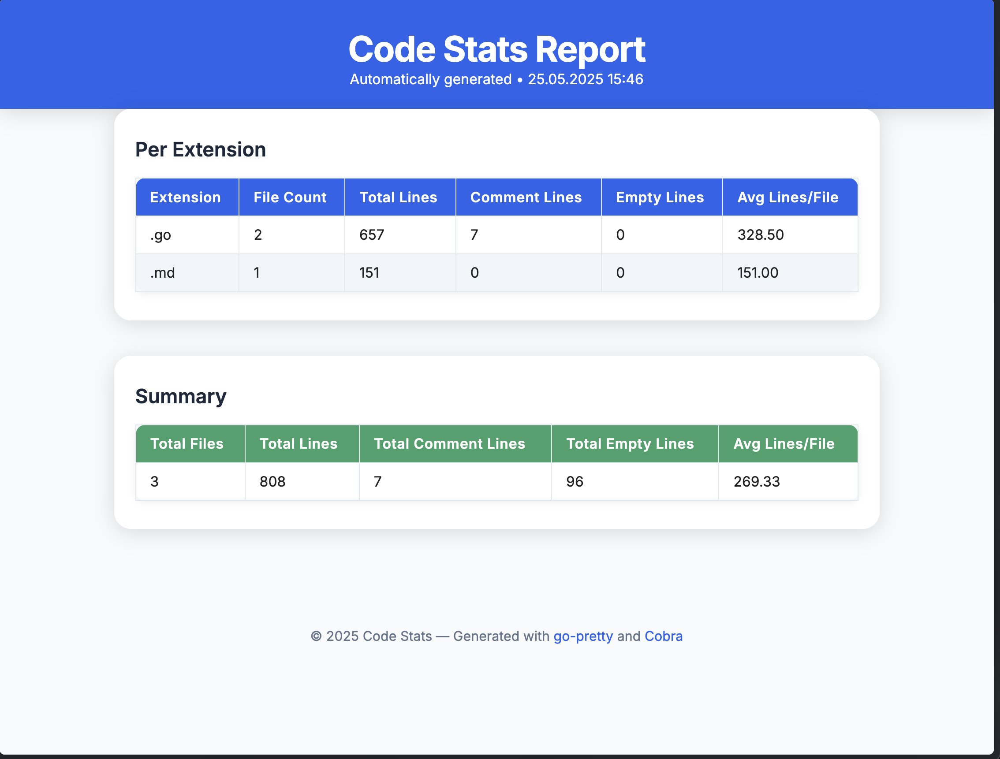

# Code Stats


> **Analyze your codebase in seconds. Get beautiful stats, insights, and reports for any project.**

---

## 🚀 What is Code Stats?

**Code Stats** is a blazing-fast CLI tool to analyze your codebase and get instant statistics:

- File counts, line counts, comment lines, and empty lines
- Per-extension breakdown (e.g., `.go`, `.js`, `.ts`, ...)
- Ignore directories and filter by file extension
- Export results as CSV, JSON, or a beautiful HTML report
- Modern, responsive HTML output for sharing or archiving

Whether you're curious about your project's size, want to track documentation coverage, or need a quick report for your team, Code Stats has you covered!

---

## ✨ Features

- **Fast, parallel directory scanning**
- **Customizable:** Choose which file extensions and folders to include/exclude
- **Detailed stats:**
  - Total files, lines, comment lines, empty lines
  - Per-extension stats and averages
- **Export:**
  - CSV, JSON, and modern HTML reports
- **Colorful, readable CLI output**
- **Progress and verbose modes**
- **Cross-platform** (macOS, Linux, Windows)

---

## 🛠️ Installation

Clone the repo and build with Go (requires Go 1.21+):

```sh
git clone https://github.com/yourusername/code-stats.git
cd code-stats
go build -o code-stats
```

Or run directly:

```sh
go run main.go [options]
```

---

## ⚡ Usage

Analyze the current directory:

```sh
./code-stats
```

Analyze a specific directory, only `.go` and `.js` files, ignoring `node_modules`:

```sh
./code-stats -e go,js -i node_modules
```

Show progress for each file:

```sh
./code-stats --progress
```

Export as CSV, JSON, or HTML:

```sh
./code-stats --csv -o stats.csv
./code-stats --json -o stats.json
./code-stats --html -o stats.html
```

Suppress all console output (for CI):

```sh
./code-stats --json -o stats.json --verbose
```

---

## 🧩 CLI Options

| Option                | Description                                                      |
|-----------------------|------------------------------------------------------------------|
| `-e`, `--ext`         | Comma-separated list of file extensions to include                |
| `-i`, `--ignore`      | Comma-separated list of directories to ignore                     |
| `-c`, `--color`       | Enable colored CLI output                                         |
| `-p`, `--progress`    | Show progress output for each processed file                      |
| `--csv`               | Export stats as CSV (use with `-o`)                               |
| `--json`              | Export stats as JSON (use with `-o`)                              |
| `--html`              | Export stats as HTML (use with `-o`)                              |
| `-o`, `--output`      | Output file for export                                            |
| `--verbose`           | Disable all console output except errors and export confirmation   |

---

## 📊 Example Output

### CLI Table

```
EXTENSION   FILE COUNT   TOTAL LINES   COMMENT LINES   EMPTY LINES   AVG LINES / FILE
.go         12           1,234         210             123           102.83
.js         5            500           50              40            100.00

TOTAL FILES   TOTAL LINES   TOTAL COMMENT LINES   TOTAL EMPTY LINES   AVG LINES / FILE
17            1,734         260                   163                 102.00
```

### HTML Report

The HTML export (`--html -o stats.html`) creates a modern, responsive report you can open in any browser:



---

## 📝 License

MIT — free for personal and commercial use.

---

## 💡 Contributing

Pull requests and issues are welcome! If you have ideas for new features or improvements, open an issue or PR.

---

## 🙏 Credits

- [go-pretty](https://github.com/jedib0t/go-pretty) for beautiful tables
- [Cobra](https://github.com/spf13/cobra) for CLI
- [fatih/color](https://github.com/fatih/color) for color output

---

**Made with ❤️ by [Your Name](https://github.com/yourusername)** 